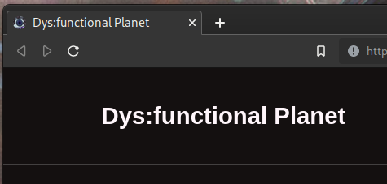

# Dys:/function website
Jekyll site for the Dys:/function website and blog.


This project uses the Github Actions for deployment.


## Local testing

### Install system reqirements
Arch Linux
```bash
sudo pacman -S git make ruby
```

Ubuntu
```bash
sudo apt update && sudo apt install -y git make ruby
```

### Clone this repository
```bash
git clone git@github.com:dys-function/jekyll-prototype.git && cd jekyll-prototype
```

### Install website requirements
```bash
make install
```

### Build/test the website locally
```bash
make test
```

Then, navigate to [http://127.0.0.1:4000/](http://127.0.0.1:4000/) in your browser.


## Development

### Theme
The Jekyll theme in use is [Minimal Mistakes](https://mmistakes.github.io/minimal-mistakes/docs/collections/).

### Project Layout
```txt
jekyll-prototype
├── 404.html                # 404 page configuration
├── assets                  # Contains any art assets
├── _books                  # Contains content for individual books
├── _config.yml             # Main website configuration
├── _data                   # Parameterized data for use throughout the website
├── favicon.ico             # The favicon image in use for the website
├── Gemfile                 # Specifies Ruby dependancies
├── Gemfile.lock            # Specifies the exact versions in use of Ruby dependancies
├── index.md                # Configuration for home page
├── Makefile                # Makefile with common commands for development
├── _pages                  # Contains configuration of pages that show up in navigation
├── _posts                  # Containes individual posts
├── README.md               # Readme file
├── _sass                   # Contains custom changes to theme
├── _site                   # Generated site files
└── _slices                 # Content for individual Slices
```

### Assets
Any art assets used in the website should be placed in the `assets/` directory. Assets can be referenced from other makrdown files like so: `/assets/prelude_cover.jpg`.

### Configuration

### Ruby Dependancies
The website's Ruby dependancies can be found in `Gemfile` in the root of this project. The dependancies' versions are maintained in `Gemfile.lock`.

### Index
The homepage configuration of the website is defined in `index/md`. The default configuration for the website's homepage is set to display blog posts.

### Favicon
The favicon is the small image in a browser's tab that you see when accessing this site.
The file in the root directory of this project called `favicon.ico` will be the favicon for the site. 



To set the favicon for this site:
```bash
cp /path/to/image/file ./favicon.ico
```

### Pages
Each markdown file under the `_pages/` directory represents a different page of the website in the top bar navigation.

### Posts
Individual posts can be found in the `_posts/` directory. Each post is represented a a single file with the following naming scheme:

YYYY-MM-DD-name-of-post-file.md

Posts will be automatically sorted on the website in chronological order.

### Books
The **Books** page (`_pages/books.md`) uses the "collection" format. Each book in the collection is represented as a single markdown file in the `_books/` directory.

### Slices
The **Slices** page (`_pages/slices.md`) uses the "collection" format. Each slice in the collection is represented as a single markdown file in the `_slices/` directory.

### 404
The 404 or, "Page Not Found" page is defined in a file in the project root directory called `404.html`.

## References
- Jekyll: https://jekyllrb.com/
- Deploy Jekyll with Github Actions/Pages: https://jekyllrb.com/docs/continuous-integration/github-actions/
- Minimal Mistakes Jekyll theme: https://github.com/mmistakes/minimal-mistakes
- Ruby Bundler: https://bundler.io/
